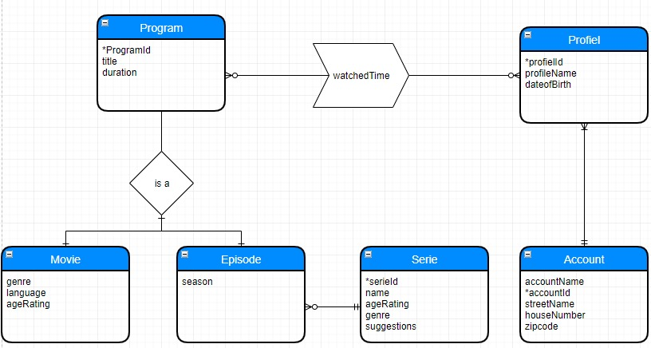
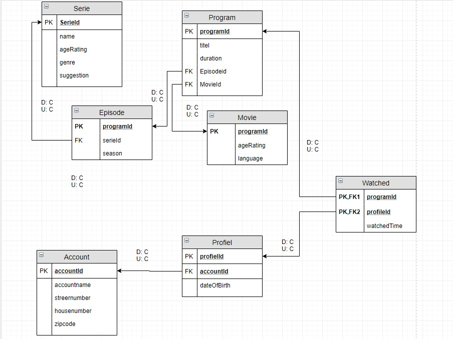
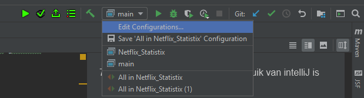

#Netflix Statistix
#Coen Ribbens(2151482)
#Marcello Haddeman(2152991)
#Thomas Meeusen(2151718)

Class Diagram
=========

ERD 
=====

In bijlage A is de ERD van de database te vinden.
 Profiel heeft altijd één account, omdat een profiel nooit op zichzelf kan bestaan en niet bij meerdere accounts hoort.  Profielen bekijken programma’s. Dit wordt opgeslagen in de tussentabel Watched. 
De tabel Program, heeft een ‘is a’ relatie met Movie en Episode. Deze relatie weergeeft een supertype-subtype relatie. Het supertype Program kan niet op zichzelf voorkomen en is dus altijd een Movie of Episode. De reden hiervan is dat er anders twee relaties van Watched naar Episode en Movie gaan, en op deze manier is het veld ‘duration’ niet meer redudant. In de implementatie is er een check constraint toegepast op Program die controleert of het programma is toegewezen aan een film of episode, maar in het geval van allebei, of geen van beide, wordt er een error gegeven.

Relationeel Databaseontwerp
====

In bijlage B is het relationele ontwerp van de database te vinden.

Wat vrijwel meteen opvalt is dat er voor iedere Delete- en Update rule de optie cascading is gekozen. Dit was het makkelijkst, omdat als er iets aangepast/verwijderd moest worden, bijvoorbeeld een waarde in de kolom serieId van de tabel Serie, dat het dan ook gelijk aangepast/verwijderd werd in de foreign key tabel van Episode. Dit geld ook voor de relaties Account – Profiel en Program – Movie/Episode en Serie - Episode. Voor deze relaties geldt dat de optie SET NULL nooit had gekund. Een profiel bestaat niet zonder een account, een programma is altijd een Episode of Movie en een Episode hoort altijd bij een serie. 
De optie No Action is niet handig, omdat het eigenlijk alle mogelijkheden blokkeert van een primary key veld die een koppeling heeft.
De optie Set default was niet relevant, want er is nergens een default waarde ingesteld. 

De tussentabel Watched heeft twee velden die allebei een foreign key zijn en samen een ’composed key’ zijn. Dit zijn programId en profileId. De reden dat dit een composed key is, is omdat een profiel een bepaald programma niet meerdere keren kan bekijken in de zin dat er meerdere records worden gemaakt voor dezelfde combinatie. Als een profiel hetzelfde programma opnieuw bekijkt wordt dit bijgeschreven aan het veld watchedTime. 

#Normalisatie

In bijlage C is de volledige normalisering in de derde normaalvorm te vinden. Niet alle records zijn in de normalisering toegevoegd, omdat het anders een erg groot Excel-bestand zou worden. Een aantal tabellen zijn gesplitst m.b.t. het voorkomen redudantie.
•	Profiel en account zijn van elkaar afgesplitst vanwege redundantie. 
•	Serie en Episode zijn van elkaar afgesplitst vanwege redundantie.
WatchedTime uit de tabel watched is afhankelijk van de composed key profileId en programId. Dit is een koppeltabel en had niet verder opgesplitst kunnen worden.
Aangezien de tabel program een supertype is, is het afhankelijk van of episodeid of movieId, omdat het niet op zichzelf kan bestaan.  De verwijzingen hiervan, de programId’s van Episode en movie, zijn de determinanten van hun tabel. Een genre van een onbekende film zegt niks. 

#Handleiding opzetten applicatie

###Database
Deze handleiding gaat uit van een paar dingen:
De gebruiker heeft Microsoft Management Studio geinstalleerd, indien dit niet het geval is kan de handleiding hieronder gevonden worden:
https://www.sqlshack.com/sql-server-management-studio-step-step-installation-guide/

De gebruiker heeft IntelliJ geinstalleerd en klaar gemaakt voor gebruik, indien dit niet het geval is kan de handleiding hier gevonden worden.
https://www.jetbrains.com/help/idea/installation-guide.html#

Voor het opzetten van de database is een sql bestand aanwezig binnen het project genaamd
[scripts.sql](https://github.com/coenribbens/Netflix-statistix/blob/master/script.sql).
1. Open Microsoft Server Management Studio
2. Open een nieuw queryscherm
3. Kopieer de bestanden van het script bestand naar het queryscherm binnen SMSS
4. Klik nu op de "Execute" knop binnen SMSS
5. De database zal nu automatisch geinstalleerd worden op de huidige server.

Hierna kan de applicatie opgezet worden

#Applicatie
1. Navigeer naar de github pagina van de applicatie, deze is te vinden door op deze knop te drukken 

2. Druk op de "Clone or Download" knop, deze knop zal nu uitvouwen en meerde opties laten zien
3. Selecteer de optie "Download ZIP"
4. Nu zal er een ZIP bestand gedownload worden die het project bevat
5. Maak een lege map aan de desktop van de PC
6. Open het ZIP bestand en verplaats alle bestanden naar de lege map op de desktop
7. Open de gewenste IDE (Het gebruik van intelliJ is aangeraden)
8. In IntelliJ, selecteer de "File" optie en druk vervolgens op "Open"
9. Selecteer vervolgens de map waarin de applicatie zich bevindt.
(Nu zal de applicatie inladen in de IDE).
10. Druk op de knop uitvouwmenu (links naast de groene pijl om het project te starten)

11. Bij het invoerveld van "VM Options", vul het volgende in: "-p "{locatie_van_de_repo}\libs\javafx-sdk-11.0.2\lib" --add-modules javafx.controls"
12. Druk rechtsonder op apply, en sluit dit scherm.
13. Selecteer nu het map icoon met de drie vierkanten, op dezelfde taakbalk als de startknop
14. Ga naar het tabblad voor "libraries"
15. Druk op de plus en selecteer de "Java" optie
16. Navigeer naar de "lib" map in het project en selecteer hierbij de map "javafx-sdk-11.0.2\lib" en het bestand "mssql-jdbc-7.4.1.jre12.jar".
17. Selecteer apply en voeg de bestanden toe, hieran kan dit scherm gesloten worden.
18. Druk op de groene pijl linksboven in de desbetreffende IDE
(Nu zal de applicatie de applicatie klaarmaken voor gebruik en deze openen wanneer gereed).

#Git repository

#Reflectie Thomas Meeusen
Netflix statistics was mijn eerste echte softwareproject. Er zijn daarom ook een aantal dingen verkeerd gegaan. Ik liep bijvoorbeeld enorm vast met Git: pushen en comitten ging niet lekker en ik wist niet precies hoe branches werkte. Mijn teamgenoot legde dit gelukkig stap voor stap uit, en introduceerde mij aan GitKraken, een programma wat de hetzelfde functies heeft als Git, maar met een grafische interface. Dit werkt erg fijn. Ik ben in het begin veel bezig geweest met het opzetten van de database inclusief de ontwerpen en constraints. Daarna heb ik o.a. geholpen met de interface van de film- en serie tabblad. Aan het eind ben ik bezig geweest met de toast berichten.

Ik heb van deze opdracht het belang geleerd van een class diagram. Dit geeft voor jezelf een overzicht en eigenlijk is het een must als je in een team werkt. Anders ontstaat er een situatie van ‘meerdere kapiteins op één schip’. Waarbij de ontwikkelaars elkaar in de vingers snijden, omdat zij ieder een ander idee hebben van hoe de applicatie moet functioneren. Wat ik ook van deze opdracht heb geleerd is dat het samen veel makkelijker gaat. Met je drieën zie en kan je veel meer dan wanneer je het alleen zou moeten doen. 

Tot slot is het erg jammer dat ik het begrip ‘business logica’ verkeerd geïnterpreteerd heb. In de rubric staat: voorzie de business logica van unit tests.  Ik heb hier een verkeerde link gelegd met de application logic layer. Daardoor heb ik in totaal een volledige dag besteed aan het creëren van unittests voor de controllers in de application logic layer met een aparte library genaamd ‘testFX’.
Gelukkig kwam ik er op tijd achter dat er met logica een methode die gedrag heeft wordt bedoeld, en heb ik daar unittests voor geschreven. Ik heb hiervan geleerd dat ik eerst om duidelijkheid moet vragen voordat ik ergens van uit ga. Ondanks dat ik een dag bezig ben geweest met iets wat niet de opdracht was, zie ik het niet als verspilde tijd en moeite. testFX kan nog wel eens handig wezen voor in de toekomst.

Tot slot wil ik zeggen dat ik van dit project enorm veel heb geleerd. Dit komt vooral omdat dit mijn eerste project was. 

#Reflectie Coen Ribbens
Ik had hiervoor al enige kennis over het bouwen van een applicatie en de processen die hierachten liepen.
Het concept van de applicatie was al vrij interessant,
hiernaast was het eindelijk schrijven van code weer een goede rede om hier aan te beginnen.
De ontwerpfase was niet uitzonderlijk moeilijk aangezien ik voorkennis heb kunnen gebruiken van mijn vorige opleiding.
Het deel het meest tegenviel bij de ontwerpfase was de onzekerheid van de koppeltabllen die nodig zouden zijn.
Het schrijven van de code ging zonder te veel moeite en was snel te doen, hier heb ik eigenlijk weinig tot geen problemen mee gehad.
Het schrijven van de documentatie viel iets meer tegen aangezien ik in een redelijk
lange tijd geen handleidingen had geschreven, en al zeker niet in markup.
Een interessant project met een redelijk goede uitkomst.

#Reflectie Marcello Haddeman
Dit is de eerste keer dat ik mee heb gedaan aan een softwareproject. Ik moet zeggen dat het samenwerken toch wel veel moeilijker is dan gedacht. Ervoor zorgen dat iedereen op de hetzelfde spoor zit van gedachtegang is toch wel een klus. Anders dan dat ging het in het algemeen wel redelijk goed, de voorkennis van Coen heeft ook geholpen met het structureren van de applicatie. Ik heb vooral gefocust op de views van de applicatie, hierbij deed ik beide werken aan de front-end en de back-end. Dit is de eerste keer dat ik met JavaFX heb gewerkt en dus heb ik heel veel informatie online moeten opzoeken hoe je bepaalde dingen doet.
Terwijl het werk origineel was afgekeurd was heel veel werk al gedaan en koste het niet al te veel tijd om het af te ronden. Dit kwam uiteindelijk goed uit sinds we hierdoor ons compleet konden concentreren op andere projecten. De rede waarom het origineel was afgekeurd wat omdat we veel te weinig tijd hadden om alles goed te implementeren, daarom wil ik voor toekomstige projecten eerder beginnen. Ook wil ik projecten waarbij databases bij komen eerst aan de database werken voordat er wordt gewerkt aan de applicatie, hierdoor hoeven we niet later SQL query’s aanpassen om het te laten werken met aanpassingen in de database, iets wat we met dit project wel moesten doen.

#Samenwerkingscontract
Het samenwerkingscontract is verder te vinden in de Docs map
